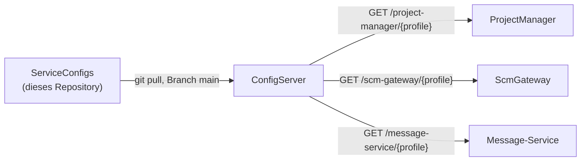

# ServiceConfigs

Git-Backend für den **[ConfigServer](https://github.com/Office-OS/ConfigServer)**
(Spring Cloud Config). Enthält die zentral verwalteten Konfigurationswerte aller
Office.OS-Spring-Boot-Dienste je Profil – die Dienste selbst importieren beim Start nur
`spring.config.import=configserver:...`, die tatsächlichen Properties liegen hier.

## Architektur

## Namenskonvention

Dateien folgen dem Schema `{spring.application.name}-{profile}.properties`, plus eine
profil-übergreifende `application.properties` (Werte, die für alle Dienste/Profile
gelten, z. B. der Name des Notification-Exchange) und `application-{profile}.properties`
(z. B. gemeinsame Eureka-/RabbitMQ-Adressen je Umgebung):

| Datei | Gilt für |
|---|---|
| `application.properties` | Alle Dienste, alle Profile |
| `application-dev.properties` / `application-prod.properties` | Alle Dienste, jeweiliges Profil |
| `project-manager-dev.properties` / `-prod.properties` | Nur ProjectManager |
| `scm-gateway-dev.properties` / `-prod.properties` | Nur ScmGateway |
| `message-service-dev.properties` / `-prod.properties` | Nur Message-Service |

`dev` und `prod` entsprechen dem über `SPRING_PROFILES_ACTIVE` aktivierten Profil des
jeweiligen Dienstes.

## Modulare Architektur

**ProjectHub** (ProjectManager) ist das Hauptmodul der Office.OS-Landschaft und läuft
eigenständig. **Message-Service** (E-Mail-Benachrichtigungen) und **ScmGateway**
(GitHub-Integration) sind optionale Module, die ProjectHub über RabbitMQ bzw. REST
anspricht, aber nicht zwingend benötigt – siehe das ProjectManager-README, Abschnitt
"Modulare Architektur", für die Details zum Verhalten bei Deaktivierung.

Gesteuert wird das über zwei Properties in `project-manager-dev.properties` und
`project-manager-prod.properties`:

| Property | Modul | Zustand in `dev`/`prod` |
|---|---|---|
| `app.modules.message-service.enabled` | Message-Service | `true` (aktiviert) |
| `app.modules.scm-gateway.enabled` | ScmGateway | `true` (aktiviert) |

Beide sind hier bewusst in **beiden** Profilen auf `true` gesetzt, da Message-Service
und ScmGateway in der Office.OS-Landschaft aktuell überall mitbetrieben werden. Wird ein
Modul in einer Umgebung nicht deployt, kann es hier durch Setzen auf `false`
abgeschaltet werden, ohne ProjectHub selbst anzufassen (Default bei fehlender Property
ist ebenfalls `true`, siehe `ProjectManager`-Quellcode).

## ⚠️ Sicherheitshinweis

Die `-prod.properties`-Dateien enthalten aktuell **Klartext-Zugangsdaten** (Datenbank-
Passwörter, den Authentik-API-Token, das GitHub-Webhook-Secret sowie das SMTP-Passwort
des Mailproviders). Das ist der übliche erste Schritt für ein Config-Server-Git-Backend,
aber auf Dauer riskant – schon ein versehentlich auf `public` gestelltes Repository,
ein CI-Log oder ein Fork würden alle Secrets offenlegen, und jede Rotation erfordert
einen Commit im Klartext.

Empfehlung für den nächsten Ausbauschritt: Secrets aus diesem Repository entfernen und
stattdessen entweder

- über Umgebungsvariablen bzw. Docker/Ansible-Secrets an die Dienste durchreichen
  (Spring liest `application-*.properties` und Umgebungsvariablen zusammen; Secrets
  müssten dafür nicht mehr hier stehen), oder
- ein dediziertes Secret-Backend für den Config Server nutzen (z. B. verschlüsselte
  Properties über `{cipher}`/einen Encrypt-Key, oder ein Vault-Backend statt Git für
  die sensiblen Werte).

Bis dahin: Zugriff auf dieses Repository so eng wie möglich halten und bei jedem
Verdacht auf Kompromittierung die betroffenen Werte (DB-Passwörter, Authentik-Token,
Webhook-Secrets, SMTP-Zugangsdaten) zeitnah rotieren.

## Lokale Entwicklung

Dieses Repository ist Teil des Office.OS-Monorepo-Setups über Git-Submodule. Für die
lokale Entwicklungsumgebung siehe das
**[Develop](https://github.com/Office-OS/Develop)**-Repository.
